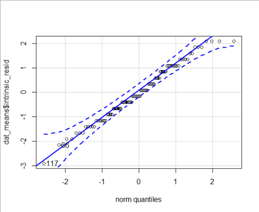

```{r setup, include = FALSE}
knitr::opts_chunk$set(echo = TRUE)
if (!requireNamespace("webexercises")) {
  stop("You must have the 'webexercises' package installed to knit to HTML.\n   install.packages(\"webexercises\")")
} else {
  library("webexercises")
  library(tidyverse)
}
```

It’s important to be able to use your statistics knowledge to interpret data and give the numbers meaning, and the best way to do that is through practice! In this self-directed activity we want you to work through the tasks, see what you interpret the data as, and then check against the interpretation we offer. Don't expect an exact match in wording but the interpretation should be similar. If you spot any major differences between what you say and what we say, remember to ask us about it!

## Activity 1

Look at the below table and then answer the questions:

|Group|N  |Mean|SD |Min|Max|
|:---:|:-:|:--:|:-:|:-:|:-:|
|1    |50 |80.31|9.21|53.64|105.94|
|2    |50 |50.30|1.83|45.10|54.68|

* Which group has the highest average score? `r longmcq(c(answer = "1","2"))`
* Which group has the largest variability within the sample? `r longmcq(c(answer = "1","2"))`
* Which of these would be an appropriate synopsis?
`r longmcq(c("Group 1 had a mean of 80.31 and an SD of 9.21. Group 2 had a mean of 50.30 and an SD of 9.21",
answer = "Group 1 had a higher score (M = 80.31, SD = 9.21) than Group 2 (M = 50.30, SD = 1.85)",
"Group 2 had a higher score (M = 80.31, SD = 9.21) than Group 1 (M = 50.30, SD = 1.85)",
"Group 2 had a mean of 80.31 and an SD of 9.21. Group 1 had a mean of 50.30 and an SD of 9.21"))`

`r hide("See an interpretation")`

* The mean of Group 1 is larger than Group 2 meaning they have a larger average score. 
* Likewise the standard deviation of Group 1 is larger meaning that they have larger variation.

* In terms of a summary sentence, the correct answer would be "Group 1 had a higher score (M = 80.31, SD = 9.21) than Group 2 (M = 50.30, SD = 1.85)" because it remembers to compare the difference between the two groups, has the appropriate data with the right group, and presents the values in appropriate APA format with whitespace.

`r unhide()`

## Activity 2

Look at the below plots and then answer the questions on skew:


* Dataset A appears to be most likely `r longmcq(c(answer = "positively skewed","negatively skewed","normally distributed"))`
* Dataset B appears to be most likely `r longmcq(c( "positively skewed",answer ="negatively skewed","normally distributed"))`
* Dataset C appears to be most likely `r longmcq(c( "positively skewed","negatively skewed",answer ="normally distributed"))`
* Dataset D appears to be most likely `r longmcq(c( "positively skewed","negatively skewed",answer ="normally distributed"))`


`r hide("See an interpretation")`

* Remember that nothing will look perfect and a lot of the time it is a best guess.
* Positive skews have a tail leading off to the higher numbers and lots of data bunched at the lower numbers. As such Dataset A would be best described as positively skewed.
* Negative skews have a tail leading off to the lower numbers and lots of data bunched at the higher numbers. As such Dataset B would be best described as negatively skewed.
* Whilst Datasets C and D are not perfect they would most likely be considered well within the normal boundaries to be considered as normally distributed.

`r unhide()`

## Activity 3

Look at this plot of distributions regarding gender and anxiety and try to answer the following questions:


* Men have significantly lower anxiety than women `r torf("FALSE")`
* Women have significantly higher anxiety than non-binary `r torf("FALSE")`
* There is no significant difference between women and non-binary `r torf("FALSE")`

`r hide("See an interpretation")`

* OK yes this was a trick question. All the answers are FALSE because you can't make a conclusion about significance based on the distributions and descriptives.
* What you could say here is that it looks like men have lower overall anxiety, or that the anxiety levels of women and non-binary appear similar, but you can't make statements about significance or say that there are significant differences or not without first running an inferential test.
* In short, be careful of the words you use when describing relationships based on descriptive data.
`r unhide()`

## Activity 4

Have a look at this scatterplot and answer the following question:


Here we could say that, `r longmcq(c("There is no significant relationship between Variable A and Variable B",
answer = "There appears to be a strong positive relationship between Variable A and Variable B",
"There appears to be a weak negative relationship between Variable A and Variable B",
"There is a significant positive strong relationship between Variable A and Variable B"))`

`r hide("See an interpretation")`

* The main thing here is to remember that this is just a descriptive test and so you can't say significant or not.
* Next we consider the strength and the direction. As B increases as A increases then it appears to be positive. Likewise the strength appears to be strong as the two variables are increasing by a similar amount each step.
`r unhide()`

## Activity 5

Have a look at this scatterplot and answer the following question:


Here we could say that, `r longmcq(c(answer = "There appears to be no relationship between Variable A and Variable B","There appears to be a strong positive relationship between Variable A and Variable B",
"There appears to be a weak negative relationship between Variable A and Variable B",
"There is a significant positive strong relationship between Variable A and Variable B"))`

`r hide("See an interpretation")`

* The main point of this one is to show that it is ok to say from the descriptives that there appears to be no relationship. You could argue that this is actually a very weak relationship and both would be acceptable. But don't feel you have to say that there is a relationship when there isn't.
`r unhide()`

## Activity 6

Have a look at this violin-boxplot and table, and answer the following question:


|Employed|N  |Mean|SD  |
|:------:|:-:|:--:|:--:|
|True    |40 |5.18|1.35|
|False   |40 |5.06|1.24|

Which of these would be an appropriate summary: `r longmcq(c("Those that are employed had a mean of 5.18 (SD = 1.35) and those that are not employed (N = 40, M = 5.06, SD = 1.24). There is a figure and table to look at as well.",
answer = "From the figure and table, it would appear that those that are employed (N = 40, M = 5.18, SD = 1.35) have a similar extrinsic motivation score to those that are not employed (N = 40, M = 5.06, SD = 1.24)",
"From the figure and table, it is clear that there is no significant difference between those that are employed (N = 40, M = 5.18, SD = 1.35) hand those that are not employed (N = 40, M = 5.06, SD = 1.24) in terms of extrinsic motivation",
"From the figure and table, it would appear that those that are employed (N=40, M=5.18, SD=1.35) have a similar extrinsic motivation score to those that are not employed (N=40, M=5.06, SD=1.24)"))`

`r hide("Show me an interpretation")`

* This comes down to write-up and that professional level of communication we hope for in our writing. Remember whitespace before and after equal signs, remember to compare the relationship, and to mention the figure and tables support this interpretation (they are not just there to fill space)
* Taking all that together, the most appropriate answer is "From the figure and table, it would appear that those that are employed (N = 40, M = 5.18, SD = 1.35) have a similar extrinsic motivation score to those that are not employed (N = 40, M = 5.06, SD = 1.24)" as it is the only one that does all of the above.

`r unhide()`

## Activity 7

Thinking about assumptions, have a look at the below output and figure and try to answer the question:



**Shapiro-Wilk Normality test: N = 150, W = 0.98386, p-value = 0.256**

From the above we can state that our data appears normally distributed `r torf("TRUE")`

`r hide("Show me an interpretation")`

* Remember that the Shapiro-Wilk test checks for a deviation from Normality. This means that a significant finding would suggest a deviation from normality and a non-significant finding would suggest no deviation from normality.
* Remember that in the qqplot you are looking for the majority of the data to run along the diagonal line.
* Taking both of these into consideration you could establish that the data is normally distributed.
`r unhide()`

# Activity 8

Thinking about assumptions, have a look at the below output and figure and try to answer the question:


**Shapiro-Wilk Normality test: N = 2000, W = 0.99783, p-value = 0.001635**

From the above we can state that our data is normally distributed `r mcq(c("yes","no",answer = "run a different test"))`

`r hide("Show me an interpretation")`
* Ok so this is a tricky one but the first thing to remember is that the Shapiro-Wilks test just says that there is a deviation or not from the true Normal distribution. The second thing to remember is that when you have a very large sample, even small differences will appear significant, because that is how the relationship with power works.
* Taking all that together and looking at this example, we have a very large sample and most of the dots run along the qqplot diagonal. Our interpretation is that the data is probably Normal, regardless of the fact the Shapiro-Wilks test is significant, and as such we would probably say it is significant but we might also consider using another test (like a histogram) to confirm if the data is normal or not.
* Main point being is that assumptions are about interpretation more often than not, and not just about checking for cut-offs.
* Often when different tests agree then that is a good basis for making your judgement.
`r unhide()`

# Activity 9

Have a look at the below output of a t-test:

```{r act9, echo=FALSE}
set.seed(1409)
mydat <- tibble(degree = c(rep(c("post","under"),each = 50)),
                intrinsic = c(sample(1:7,50,replace = TRUE),
                              sample(1:7,50,replace = TRUE)))

myout <- t.test(intrinsic ~ degree, data = mydat)

myout_t <- myout %>% broom::tidy()

myout
```

Try writing up the output of this t-test in one sentence and then compare it to our write up. Remember to include the test, whether it is significant or not, maybe some brief summary of the means, and the appropriate inferential information in APA formatting.

`r hide("Show me an interpretation")`
A Welch's between-subjects t-test revealed no significant difference between intrinsic motivation in postgraduates and intrinsic motivation in undergraduates (M_diff = `r abs(myout_t$estimate1 - myout_t$estimate2)`, *t*(`r round2(myout_t$parameter,2)`) = `r round2(myout_t$statistic,2)`, *p* = `r round2(myout_t$p.value,3)`, d = `r round2((2 * myout_t$statistic)/sqrt(myout_t$parameter),2)`)

* Did you remember to include the effect size even though it isn't shown in the output? t-tests should always be presented with an effect size.
* Also, note the "no significant difference" and not "an insignificant difference".
`r unhide()`

# Activity 10

Have a look at the below output of a t-test:

```{r act10, echo=FALSE}
set.seed(1410)
mydat <- tibble(degree = c(rep(c("post","under"),each = 25)),
                intrinsic = c(sample(1:5,25,replace = TRUE),
                              sample(4:7,25,replace = TRUE)))

myout <- t.test(intrinsic ~ degree, data = mydat)

myout_t <- myout %>% broom::tidy()

myout
```

Try writing up the output of this t-test in one sentence and then compare it to our write up. Remember to include the test, whether it is significant or not, maybe some brief summary of the means, and the appropriate inferential information in APA formatting.

`r hide("Show me an interpretation")`
A Welch's between-subjects t-test revealed a significant difference between intrinsic motivation in postgraduates and intrinsic motivation in undergraduates with undergraduates having higher intrinsic motivation (M_diff = `r abs(myout_t$estimate1 - myout_t$estimate2)`, *t*(`r round2(myout_t$parameter,2)`) = `r abs(round2(myout_t$statistic,2))`, *p* < .001, d = `r abs(round2((2 * myout_t$statistic)/sqrt(myout_t$parameter),2))`)

* The main thing we wanted to note here is that the p-value should never be written up in scientific notation, regardless of whether or not the output from R shows it as such. If the p-value is less than .001 then state it as p < .001. Otherwise it is stated to three decimal figures.
`r unhide()`

## Activity 11

Have a look at the below output of a correlation:

```{r act11, echo=FALSE}
set.seed(4010)

mydat <- tibble(test_anxiety = sample(1:7,50, replace = TRUE), environment = sample(1:7, 50, replace = TRUE))

myout <- cor.test(mydat$test_anxiety, mydat$environment)

myout_t <- myout %>% broom::tidy()

myout

```

Try writing up the output of this correlaion in one sentence and then compare it to our write up. Remember to include the test, whether it is significant or not, maybe some brief summary of the means, and the appropriate inferential information in APA formatting.

`r hide("Show me an interpretation")`
A Pearson correlation revealed no significant relationship between test anxiety and environment, (*r*(`r myout_t$parameter`) = .098), *p* = .500.

* Watch out here that you didn't mistake the p-value for .05 and think the test was significant when it wasn't.

# Activity complete

Hopefully this has given you some good practice and a refresh in interpreting and writing up some data. Any questions or anything you are unsure of please do ask, and remember to check out the apa style guides for help in formatting of figures, tables, and statistics. The guides can be found here: [https://apastyle.apa.org/](https://apastyle.apa.org/){target="_blank"}

This assignment was created by Dr Emily Nordmann, Dr Phil McAleer and Dr Kirsty Ainsworth.